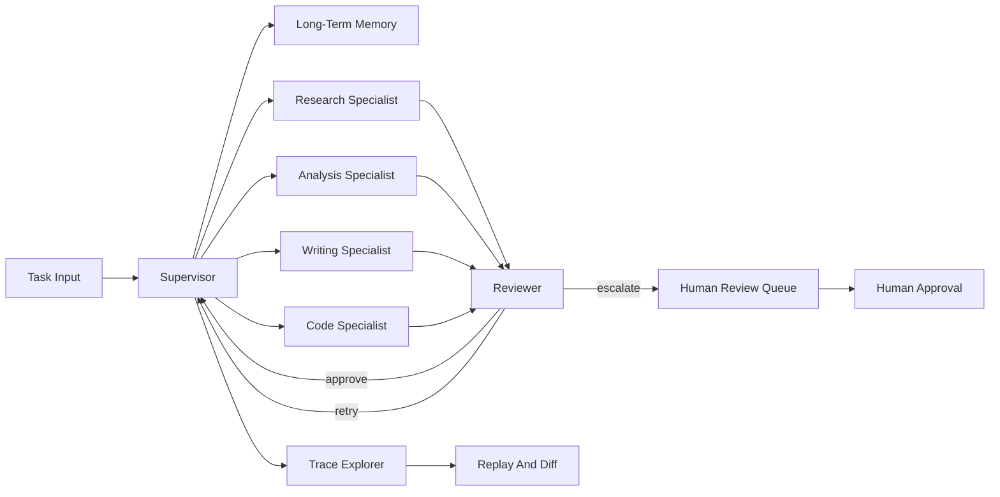

# OrchardFlow

Production infrastructure for autonomous AI workflows, not an AI demo.

OrchardFlow is a local-first orchestration runtime for multi-agent systems that need persistent memory, reviewer routing, human approval, and replayable execution traces. It gives you the core control plane for autonomous AI workflows without requiring live LLM keys or external services to run the demo and tests.

The project is useful when an agent workflow needs to do more than call one model:

- Decompose complex work into specialist steps.
- Retrieve prior outcomes and user preferences before planning.
- Route low-quality, risky, or sensitive work to a human.
- Record planning, tool calls, memory retrievals, escalations, latency, cost, and errors.
- Replay a trace with modified inputs and inspect divergence.

## Why OrchardFlow

Most agent demos are single-agent scripts. OrchardFlow is shaped as workflow infrastructure:

| Need | OrchardFlow surface |
| --- | --- |
| Task decomposition | Supervisor graph with research, analysis, writing, and code specialists |
| Quality control | Reviewer node with approve, retry, reject, and escalate routes |
| Persistent memory | Redis-style working memory plus ChromaDB/PostgreSQL-style long-term memory interfaces |
| Human approval | Review queue with Notify, Approve Action, Approve Plan, and Take Over levels |
| Auditability | Local OpenTelemetry-compatible trace records and replay helpers |
| Local development | Fake provider, placeholder-safe adapters, deterministic tests, and Docker services |

## Core Capabilities

### Multi-Agent Orchestration

The supervisor decomposes a task into specialist work, delegates to the right role, and receives reviewer decisions before continuing. The graph exposes conditional routes for completion, retries, rejection, and escalation.

### Memory-Informed Planning

Long-term memory stores outcomes, tool use, and user preferences. The supervisor can retrieve relevant memories at planning time so new runs use prior context instead of starting cold.

### Human-In-The-Loop Control

Escalation policies pause execution for low confidence, repeated failure, sensitive operations, and low quality scores. Review requests include the task context, current output, proposed action, reasoning, relevant memories, and approval level.

### Observability And Replay

Each graph run emits trace records for node execution, planning decisions, tool calls, memory retrievals, and escalations. Replay helpers let you run the same trace shape with modified input and compare the resulting execution summary.

### Placeholder-Safe Providers

OpenAI and Anthropic adapters read environment variables, but placeholder values are treated as unconfigured. Local tests and the demo use `FakeProvider`, so you can run the project without API keys.

## Quickstart

```bash
git clone https://github.com/NikolaCehic/orchard-flow.git
cd orchard-flow

python3 -m venv .venv
source .venv/bin/activate
python -m pip install -e '.[test]'

python -m orchardflow.demo
python -m pytest
```

The demo prints a JSON evidence payload showing:

- task input
- supervisor decomposition
- specialist execution
- reviewer route-back decisions
- retrieved memories
- resolved human approval
- trace summary

No OpenAI key, Anthropic key, Redis, PostgreSQL, ChromaDB, Celery worker, or Docker daemon is required for the default demo.

## Install Options

| Mode | Best for | Command |
| --- | --- | --- |
| Local package | Development and tests | `python -m pip install -e '.[test]'` |
| Review UI | Inspecting review payloads with Streamlit | `python -m pip install -e '.[review]'` |
| LangGraph compile | Compiling the graph with optional LangGraph | `python -m pip install -e '.[langgraph]'` |
| Container demo | Checking the service topology shape | `docker compose up --build app` |

You can combine extras:

```bash
python -m pip install -e '.[test,review,langgraph]'
```

## Basic Usage

Run the local graph with deterministic provider output:

```python
from orchardflow import FakeProvider, create_agent_graph

graph = create_agent_graph(provider=FakeProvider(confidence=0.95))

result = graph.run({
    "task": "Research, analyze, write, and build a deployment plan",
})

print(result["final_status"])
print(result["plan"])
print(result["trace_explorer"]["summary"])
```

Add long-term memory to planning:

```python
from orchardflow.agents import create_agent_graph
from orchardflow.memory import ChromaDBSemanticMemoryStore
from orchardflow.providers import FakeProvider

memory = ChromaDBSemanticMemoryStore(collection_name="planning")
memory.record_user_preference(
    user_id="demo-user",
    content="Prefer direct acceptance evidence in final summaries.",
)

graph = create_agent_graph(
    provider=FakeProvider(confidence=0.95),
    long_term_memory=memory,
)

result = graph.run({
    "task": "Write a concise summary with acceptance evidence",
    "user_id": "demo-user",
})

print(result["relevant_memories"])
```

Pause a run for human review:

```python
from orchardflow import FakeProvider, create_agent_graph

graph = create_agent_graph(provider=FakeProvider(confidence=0.95))
result = graph.run({"task": "Deploy the payment workflow update"})

print(result["final_status"])
print(result["review_request"]["approval_level"])
print(result["review_request"]["reasoning"])
```

## Runtime Architecture



The local implementation is deterministic by default. The intended production shape connects the same interfaces to external services:

- Redis for working memory and queue broker behavior.
- Celery workers for asynchronous execution.
- PostgreSQL for durable memory metadata.
- ChromaDB for semantic memory retrieval.
- OpenAI or Anthropic providers for live model calls.

## Configuration

Provider adapters read these environment variables:

```bash
export OPENAI_API_KEY=placeholder
export OPENAI_MODEL=openai-model-from-env
export ANTHROPIC_API_KEY=placeholder
export ANTHROPIC_MODEL=anthropic-model-from-env
```

Placeholder values are safe. The adapters report themselves as unconfigured and will not make live requests without usable credentials and an injected transport.

The Docker compose file also defaults API keys to `placeholder` for local demo runs.

## Review UI

Install the review extra and run Streamlit:

```bash
python -m pip install -e '.[review]'
streamlit run review_app.py
```

The UI renders review requests with:

- context
- proposed action
- reasoning
- relevant memories
- approval levels

Tests cover the display contract without requiring a live Streamlit server.

## Validation

Run the full local suite:

```bash
python -m pytest
python -m orchardflow.demo
```

Focused checks:

```bash
python -m pytest tests/test_agents.py
python -m pytest tests/test_memory_queue.py
python -m pytest tests/test_review.py
python -m pytest tests/test_observability.py
python -m pytest tests/test_demo.py
```

The suite is intentionally local. It does not require live OpenAI, Anthropic, Redis, PostgreSQL, ChromaDB, Celery, or Docker services.

## Project Layout

```text
orchardflow/
  agents.py          # supervisor, specialists, reviewer, graph runner
  providers.py       # OpenAI, Anthropic, and fake provider adapters
  tools.py           # schema-aware tool registry with rate limits
  memory.py          # short-term and long-term memory stores
  queueing.py        # Redis/Celery-shaped local queue interfaces
  review.py          # escalation policy and human review queue
  observability.py   # trace records, explorer export, replay helpers
  demo.py            # deterministic end-to-end demo
review_app.py        # optional Streamlit review UI
docs/architecture.md # architecture notes and container topology
tests/               # local acceptance coverage
```

## Status

OrchardFlow is a local verified prototype. The public repository includes the runtime surfaces, tests, demo, and container topology. Production hardening still requires live provider transports, real service wiring, deployment settings, authentication, persistence migrations, and operational policies for your environment.

## License

MIT. See [LICENSE](LICENSE).
