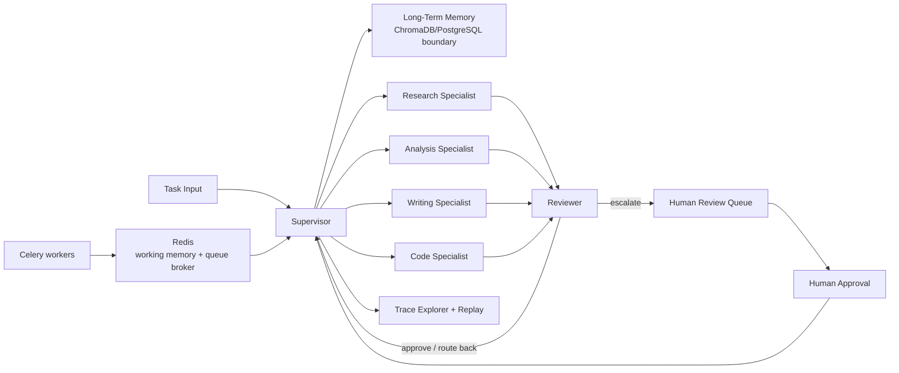

# OrchardFlow Architecture

Production infrastructure for autonomous AI workflows, not an AI demo.

## Source

Product source of truth:

`project-2-multi-agent-orchestration.md`

## Runtime Shape

## Layers

- Supervisor: decomposes task input into specialist steps, retrieves planning memories, and routes work through conditional graph edges.
- Specialists: research, analysis, writing, and code nodes use registered tools with schema and rate-limit metadata.
- Reviewer: approves intermediate output back to the supervisor, requests retries, rejects exhausted work, or escalates into human review.
- Memory: Redis-style short-term memory and ChromaDB/PostgreSQL-style long-term semantic memory expose local deterministic fallbacks for tests.
- Human approval: review queue packages context, proposed action, reasoning, relevant memories, and approval level before final delivery.
- Observability: trace records cover planning decisions, tool calls, memory retrievals, escalations, latency, cost, errors, and replay divergence.

## Demo Path

`python -m orchardflow.demo` runs the local end-to-end path without live services:

1. Accepts a production workflow task input.
2. Seeds long-term semantic memory with prior outcomes and user preferences.
3. Supervisor retrieves memories and decomposes the task into research, analysis, writing, and code specialist work.
4. Specialists produce deterministic fake-provider outputs and local tool calls.
5. Reviewer approves intermediate outputs back to the supervisor before final completion.
6. Final output is queued for human approval and resolved as approved.
7. Trace evidence includes planning, memory retrieval, tool calls, and node execution.

The local graph runner is deterministic for tests. The architecture target remains parallel specialist delegation with Redis/Celery-backed execution boundaries.

## Container Topology

`docker-compose.yml` defines:

- `app`: runs `python -m orchardflow.demo`.
- `redis`: local Redis for working memory and broker-oriented queue behavior.
- `postgres`: local PostgreSQL-oriented durable memory service.
- `chroma`: local ChromaDB-oriented semantic memory service.

API keys are not baked into the image. Compose reads `OPENAI_API_KEY` and `ANTHROPIC_API_KEY` from the environment with `placeholder` defaults for local demo runs.
